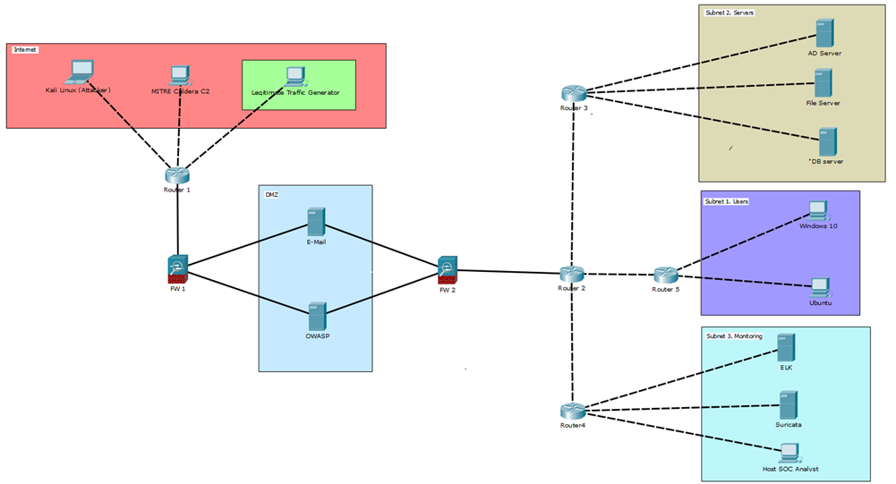

# Описание

Стенд

Для проведения имитационного моделирования была развёрнута полноценная лабораторная инфраструктура, точно воспроизводящая реальную корпоративную сеть. Схема стенда включает несколько изолированных зон, соединённых маршрутизаторами и межсетевыми экранами, что позволяет безопасно генерировать как легитимный пользовательский трафик, так и сложные многоэтапные атаки.
В красной зоне Internet расположены источники угроз и нормальной активности: рабочая станция Kali Linux (Attacker) с полным набором инструментов пентеста, автоматизированный C2-сервер MITRE Caldera для эмуляции реальных TTP по матрице ATT&CK, а также генератор легитимного трафика, имитирующий почту, веб-серфинг и работу с файлами. Трафик проходит через Router 1 и первый межсетевой экран FW 1 в DMZ, где размещены почтовый сервер E Mail и веб-сервер OWASP с уязвимыми приложениями (bWAPP, DVWA). Далее через второй firewall FW 2 трафик попадает во внутреннюю сеть.
Внутренняя инфраструктура разделена на три подсети. Subnet 2 содержит серверы предприятия: AD Server (Windows Server с Active Directory), File Server и DB server. Subnet 1 представляет рабочие станции пользователей — Windows 10 и Ubuntu. Subnet 3 — это зона SOC, где работают ELK Stack (Elasticsearch + Logstash + Kibana) для централизованного сбора и анализа логов, сетевой IDS/IPS Suricata и рабочая станция Host SOC Analyst. 